<!-- ------------------------------------------------------- -->
<!-- DO NOT REMOVE -->

```{r setup, include=FALSE}
library(knitr)
options(htmltools.dir.version = FALSE)
knitr::opts_chunk$set(echo = FALSE)
knitr::opts_chunk$set(fig.align = 'center')
```

```{r xaringan-panelset, echo=FALSE}
xaringanExtra::use_panelset()
```

```{r xaringan-tile-view, echo=FALSE}
xaringanExtra::use_tile_view()
```

```{r xaringan-tachyons, echo=FALSE}
xaringanExtra::use_tachyons()
```

```{r xaringanExtra-freezeframe, echo=FALSE}
xaringanExtra::use_freezeframe(
  selector = ".freeze-gif",
  trigger = "click",
  overlay = TRUE,
  responsive = TRUE
)
```

```{r xaringan-editable, echo=FALSE}
xaringanExtra::use_editable(expires = 1)
```

```{r xaringan-scribble, echo=FALSE}
xaringanExtra::use_scribble()
```

<!-- ------------------------------------------------------- -->
<!-- Adjust collaborator image size and position (DO NOT INSERT ANY CODE ABOVE THIS)-->

---
# Instability in Aeroplane Wings

???
What you see on the screen is a commanche jet. While flying in the air with a dozen changing parameters; speed, weather conditions, pressure etc., sometimes, some conditions can make the wing undergo rapid oscillations. If these oscillations are not detected early on, they can cause early degradation of materials, and lead to catastophic structural failure. Hence, it is very important to detect system parameter ranges where such a behaviour is likely to occur.

--
.footnote[NASA PA-30 Twin Commanche Tail Flutter Test]


---
# Airplane Wing Models

???
Since experiments are expensive, these systems can be computationally modelled using stochastic differential equations. E.g a 2 dof (pitch and plunge) model is shown here. The terms in green are all mechanical properties of the aerofoil, L and M represent the lift and moment forces, and U represents the speed on the aircraft. 

As these are stochastic equations with some randomness in them, the system of equation results in probability distributions. In this specific model, changing the value of the speed, changes the marginal probability distributions of the system. While the left most impulse shows a stable behaviour, the right most volcano-like distibution predicts high likelihood of oscillations. 

The full state space is 4-dimensional but due to the inability to visualize high-dimensional probability distribution, the analysis has been restricted to marginal distributions instead of full distributions. Is there a solution to this problem?

--


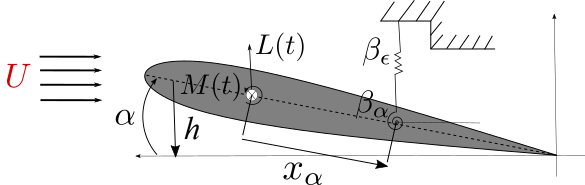

--


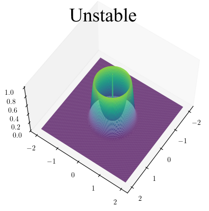


--

<br></br><br></br><br></br><br></br><br></br><br></br><br></br><br></br>

- Restricted analysis due to visualization issue. Solution?

---
# Topology: Quantify the Shape of Tensors
## H0 = connected components, H1 = loops

???
As it turns out, yes. This problem of not being able to quantify the shape of distributions in high dimensions can be solved by topology. Topology helps quantify number of connected components (represented as H0) and loops (represented as H1) in the data -- this data can be 1D, 2D, or high dimensional tensors. Higher dimensional sturtucres can also be quantified but in this presentation I will focus on just connected compontents and loops. 

Now, this computation of topology is conducted by building filtrations (which would be shown in second panel), and converting them into a persistence diagram (third panel) which can then give us something called a betti vector (4th panel). For example for the 2D probability distribution on the left which has two connected compinents and one loop structure -- the topology computed shows 2 H0 points and 1 H1 point. The betti vector also shows a value of 2 for B0 and 1 for B1. 

Now, let's look at an animation to see how this was done. 
For the distribution displayed in the left, its topology is computed by using a filtration plane for thresholding -- which moves slowly from the top of the distribution towards the bottom, binarizing the data into sets above and below it at each level. All data above (which will be displayed in white on the diagram in the middle) is included in computing of topology while the data below (which will be displayed in black) is ignored in the computation.

E.g. here: We begin with one connected component and one loop at the top. As we lower the threshold, we notice another connected component taking birth. Once the two connected components merge, we record the death of the younger component. Further, as we lower the threshold, we see that the loop fills up which is recorded as the death of the H1 component. Once we've reached the bottom, the remaining connected component also dies.

This way -> from a distribution we can quantify the number of peaks/connected components and loops in it using the betti vector.

--

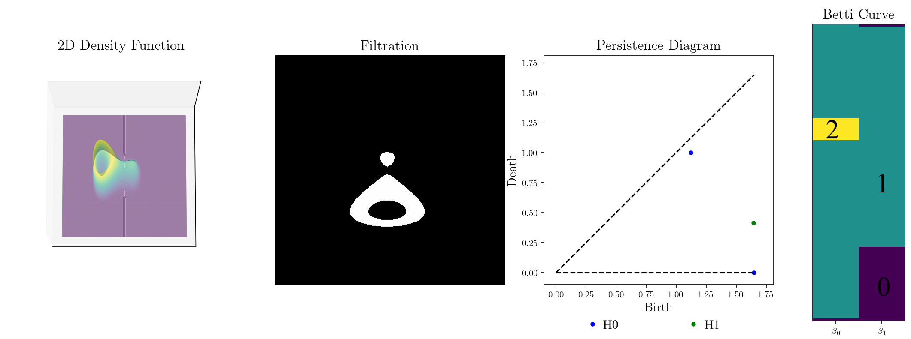

.footnote[Tanweer et al. (2024, February). A topological framework for identifying phenomenological bifurcations in stochastic dynamical systems. Nonlinear Dynamics. https://doi.org/10.1007/s11071-024-09289-1]

--

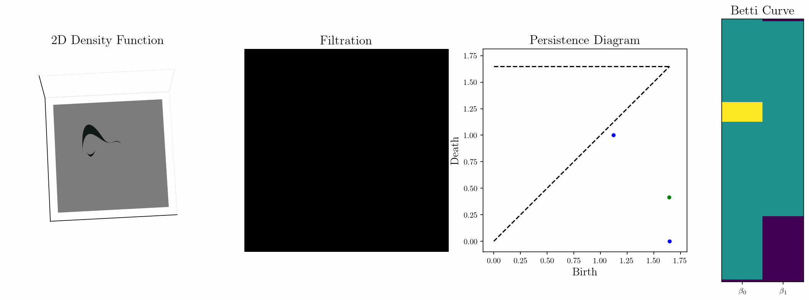

--


---
# Topology-Based Bifurcation Plot for Instability Detection

???
Once we know how to quantify the shape of one distribution, we can do it for time varying distribtions and stack all the betti vectors together to form something called a bifurcation plot displayed on the right. This plot indicates the speed at which the system undergoes a bifurcation -- which in this case is an instability in the form of oscillatory behaviour. In this bifurcation plot, the grey region shows 1 cycle in the probability distribution -- the larger it is in the betti vector, the higher the chances of oscillations. 

Now we should repeat the same steps but for 4-dimensional full distributions instead of 2D marginal distribtions. 

--


--


--
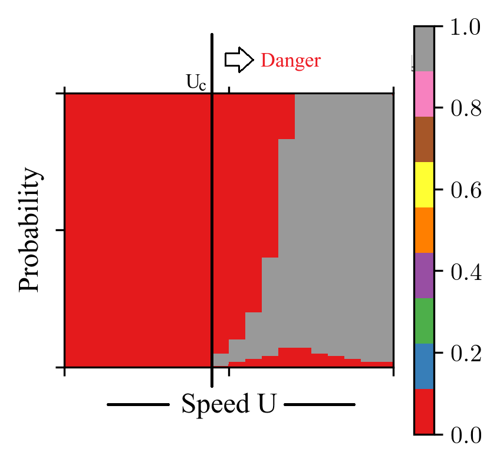

---
# Computational Complexity

???
Before we jump to the results, a little bit about the computational complexity of each step in the workflow. To solve stochastic equations, we need to run monte carlo simulations with complexity of NMdp where N is the number of sims, d is the dimension of the final density function, M is the discretization in time, and p is the size of the parameter space.

The probability distribution can be computed against each monte-carlo set with complexity of Npq^d, where q is the grid size.

And the topology can be computed with pq^d/2 times logq.

All of these seem huge, but the good thing is that each of these can be parallelized --- leading to lesser overall time required to run these simulations and gather the results. 

Overall, this study took me 20000 node-hours on US' fastest supercomputer Frontera housed in UT-Austin. Leadinf to a runtime of 4 minutes per betti vector. 

--

- Monte Carlo: $O(NMdp)$
- Probability Estimation: $O(Nq^dp)$
<!--- - Topology Computation: $O(pq^{d/2}\log{q})$ --->
- Topology Computation: $O(pd3^d q + pd^2 2^d q)$

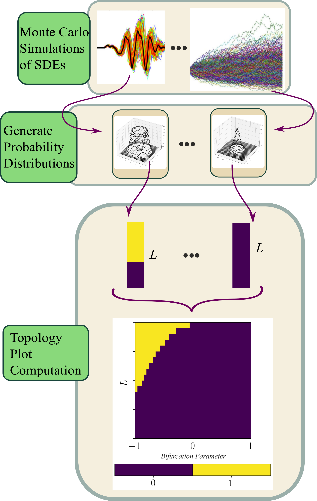

.footnote[N-simulations, d-dimension, M-time discretization, q-grid size, p-size of parameter space]

--

> Each step can be parallelized!

--

- Monte Carlo: $O(Md)$ -- $N \times p$ jobs
- Probability Estimation: $O(Nq^d)$ -- $p$ jobs
- Topology Computation: $O(d3^d q + d^2 2^d q)$ -- $p$ jobs

--

<br></br>

> Study took 20k node-hours on Frontera. 

> Leading to about 4 minutes per betti vector.

---
# Turbulence Models for Modelling Speed

???

For the full study, I tested three different turbulence models for modelling the relative speed of the aerofoil: a sinusoidal model, the Dryden model, and the Von Karman model. while the sinusoidal model is temporally uncorrelated, Dryden and Von Karman models have temporal correlation between the turbulence velocity at different times. 
The first figure shows the probability distribution from which random perturbations are sampled for all three models. While the seocnd figure shows the different Power spectral densities of each.

Collectively, they give a variety of randomness types which are used to model turbulence in the air. 

--

<div style="position: relative; height: 500px;">

  <!-- Image 1 -->
  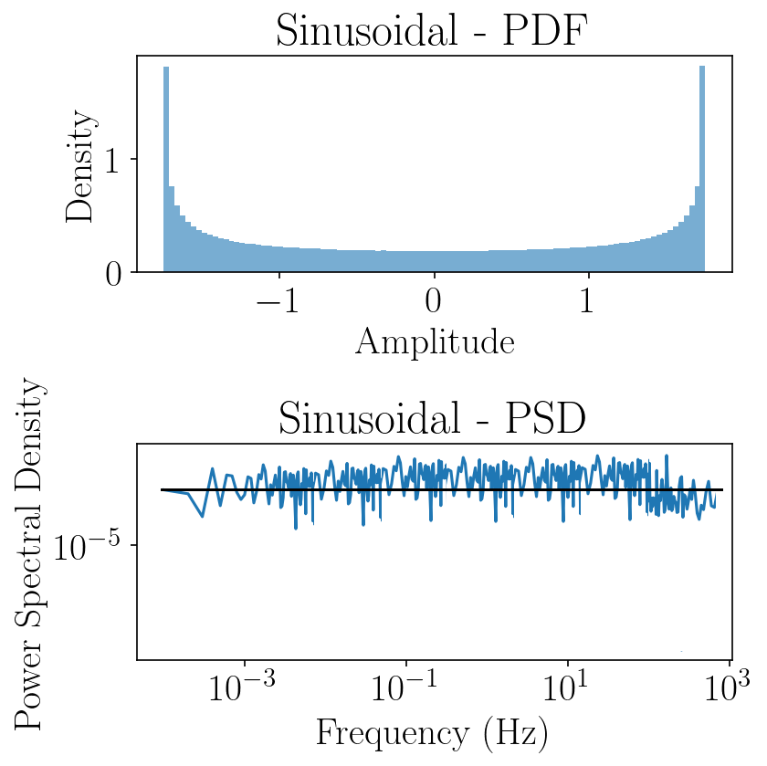

  <!-- Image 2 -->
  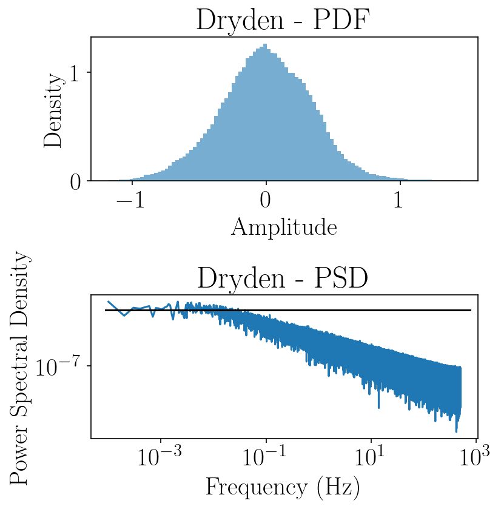

  <!-- Image 3 -->
  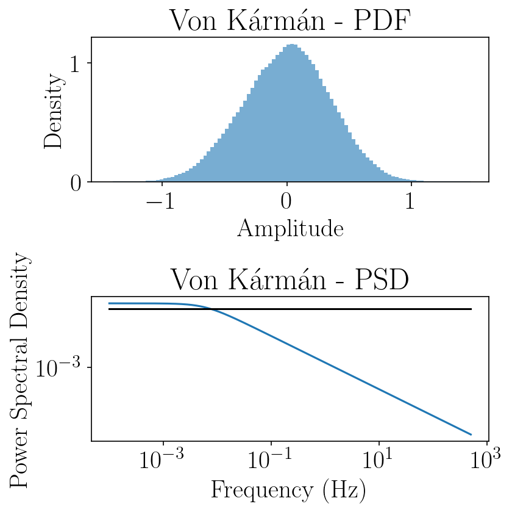

</div>

<audio id="audio1" src="figs/sinusoidal.wav"></audio>
<audio id="audio2" src="figs/dryden.wav"></audio>
<audio id="audio3" src="figs/vonkarman.wav"></audio>

<script>
function playAudio(id) {
  const audio = document.getElementById(id);
  audio.currentTime = 0;   // restart from beginning on each click
  audio.play();
}
</script>

---
# Bifurcation Plot: H0 (Connected Components)

???

Let's jump to the comparative results now. 
Figures here show the bifurcation plots for the three turbulence models for H0 connected components. The horizontal axis corresponds to the mean flow speed of the aerofoil \(U_m\), and the vertical axis corresponds to the probability threshold \(\varepsilon\) for filtration. Each color indicates the Betti number \(\beta_k\) detected at that threshold, allowing us to identify when new components emerge in the probability distribution.

For sinusoidal excitation, the density remains unimodal until approximately \(U_m \approx 5.5\) m/s, at which point the topological signature transitions from value of 1 to a value of 2 -- indicating another connected component. This transition is sharp and confined to a relatively narrow band of probability thresgolds. In contrast, both Dryden and Von Karman turbulence exhibit earlier and less abrupt transitions in \(H_0\).  
Under correlated turbulence, the density splits into multiple component as early as \(U_m \approx 5\) m/s, and this multi-component structure persists over a broader range of probability thresholds. This earlier appearance of a second component can reflect the fact that temporally correlated noise can intermittently push the system toward a second mode of stability or instability earlier.

--

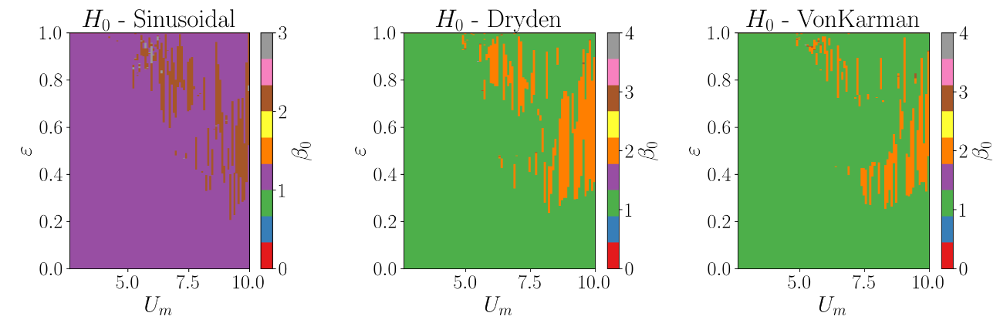


---
# Bifurcation Plot: H1 (Loops)

???

Now let's look at the bifurcation plots for H1 representing loops. The transitions in the H1 plots occur around the same speed as H0 plots. For sinusoidal excitation, loops emerge around \(U_m \approx 5.5\) m/s, representing the onset of periodic or oscillatory behaviour. Dryden and Von Karman turbulence again produce earlier transitions with a loop structure appearing as early as \(U_m \approx 4.75\) m/s. Unlike what we saw in the marginal distributions, in these models, the “bifurcation tongue’’ slopes downward with increasing \(U_m\), indicating that while loops are born early, the probability of their occurrence decreases.

This wraps up how topology-based bifurcation plots can be used to detect oscillatory or unstable behaviour in aerofoil models with high-dimensional distribtuions which cannot be visualized. 

--


--
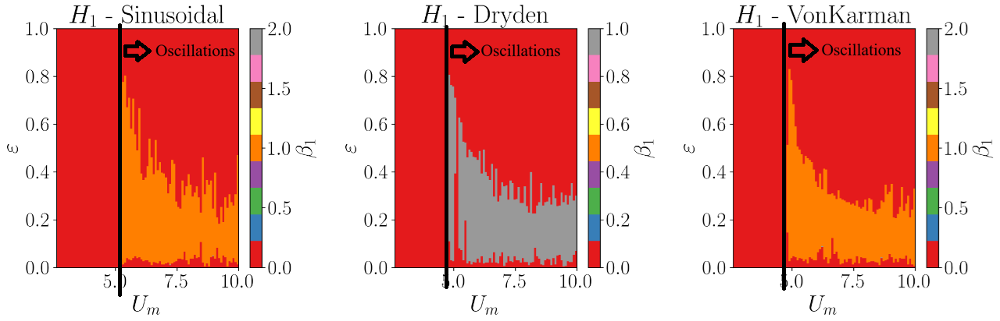


---
# Ending Note: Homeomorphism and Possible Structures

???

An ending note: in topology there's a concept called homemorphism. It relates to the idea that the betti vector we computed is non-unique. Multiple objects can have the same betti vector even if they don't necessarily look the same -- e.g. both this mug and donut have the same betti curve. So while we can use this to detect changes in behavior or oscillatory instabilities, we can't determine the details of the full high dimensional distribution. 
For this particular case where we had 2 connected compnents and 1 loop in the unstable regime---In lower dimensions, these are some possible examples of what the data generating the distribution might look like on a lower manifold. 

Quantifying the topology is the easier part -- deducing what actual distribution it comes from is a much harder problem. 

--

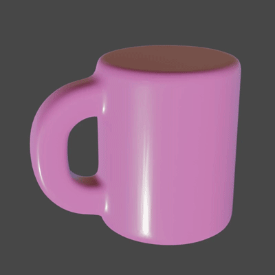

--
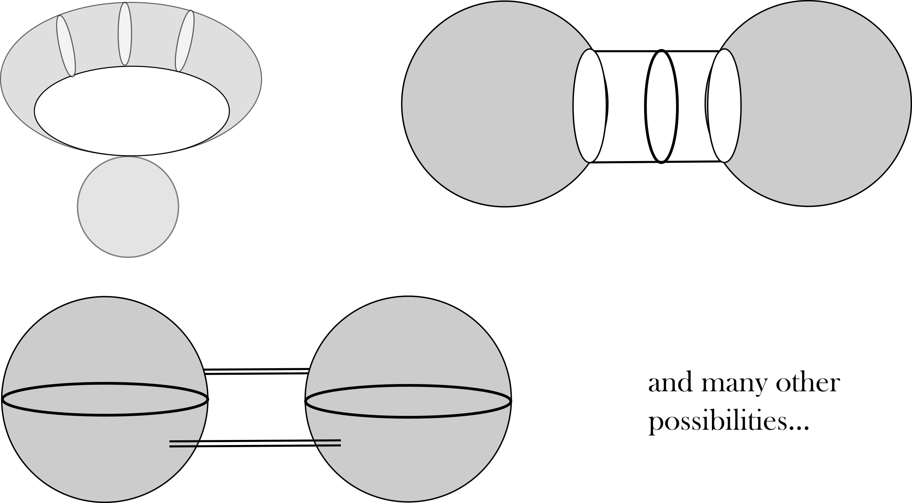

--

<br><br><br><br><br><br><br><br><br><br><br><br><br>

.bg-washed-green.b--dark-green.ba.bw2.br3.shadow-1.ph1.mt1[
From Betti Curve to full structure: a very difficult problem and an open area of research.
]


---
# Thank you! Question?

???
On that note, I will conclude my presentation on how topological algorithms can assist in detecting oscillations or instabilities in aeroplanes, to allow early intervention before a disaster. This work was completed with support from NSF-funded Frontera Computational Science Fellowship and Airforce Office of Scientific Research in collaboration with my supervisor, Firas. 

Thank you for listening!

--


**Tanweer, S.** & Khasawneh, F.A. (2025, December). P-Bifurcations in Stochastic Flutter Model Under Common Gust Perturbations. arXiv:2512.14678. Submitted.

**Tanweer, S.**, A. Khasawneh, F., Munch, E. et al. (2024, February). A topological framework for identifying phenomenological bifurcations in stochastic dynamical systems. Nonlinear Dyn. https://doi.org/10.1007/s11071-024-09289-1
