<!-- ------------------------------------------------------- -->
<!-- DO NOT REMOVE -->

```{r setup, include=FALSE}
library(knitr)
options(htmltools.dir.version = FALSE)
knitr::opts_chunk$set(echo = FALSE)
knitr::opts_chunk$set(fig.align = 'center')
```

```{r xaringan-panelset, echo=FALSE}
xaringanExtra::use_panelset()
```

```{r xaringan-tile-view, echo=FALSE}
xaringanExtra::use_tile_view()
```

```{r xaringan-tachyons, echo=FALSE}
xaringanExtra::use_tachyons()
```

```{r xaringanExtra-freezeframe, echo=FALSE}
xaringanExtra::use_freezeframe(
  selector = ".freeze-gif",
  trigger = "click",
  overlay = TRUE,
  responsive = TRUE
)
```

```{r xaringan-editable, echo=FALSE}
xaringanExtra::use_editable(expires = 1)
```

```{r xaringan-scribble, echo=FALSE}
xaringanExtra::use_scribble()
```

<!-- ------------------------------------------------------- -->
<!-- Adjust collaborator image size and position (DO NOT INSERT ANY CODE ABOVE THIS)-->

---
# Instability in Aeroplane Wings

???
What you see on the screen is a commanche jet. While flying in the air with a dozen changing parameters; speed, weather conditions, pressure etc., sometimes, some conditions can make the wing undergo rapid oscillations. If these oscillations are not detected early on, they can cause early degradation of materials, and lead to catastophic structural failure. Hence, it is very important to detect system parameter ranges where such a behaviour is likely to occur.

--
.footnote[NASA PA-30 Twin Commanche Tail Flutter Test]


---
# Airplane Wing Models

???
Since experiments are expensive, these systems can be computationally modelled using stochastic differential equations. E.g a 2 dof (pitch and plunge) model is shown here. The terms in green are all mechanical properties of the aerofoil, L and M represent the lift and moment forces, and U represents the speed on the aircraft. 

As these are stochastic equations with some randomness in them, the system of equation results in probability distributions. In this specific model, changing the value of the speed, changes the probability density of the system. While the left most impulse shows a stable behaviour, the right most volcano-like distibution predicts high likelihood of oscillations. 

However, this analysis was possible only due to the myriad of assumptions imposed on the model, making it possible to visualize a 2-dimensional probability distribution. But such assumptions severely hamper the accuracy of the analysis by restricting us to only 2-dimensional distributions. Is there a solution to this?

--

.footnote[Y. Hao, Z. Q. Wu (2019). "Random Flutter Of Multi-Stable Airfoils Excited Parametrically In Steady Flows." Journal of Mechanics Vol. 35, No 3.]


$\color{green}{M}\ddot{h} + \color{green}{S}\ddot{\alpha} + \color{green}{c_1}\dot{h} + \color{green}{K_h}h = L(t) = f(\color{red}{\bar{U}})$

$\color{green}{S}\ddot{h} + \color{green}{J_E}\ddot{\alpha} + \color{green}{c_2}\dot{\alpha} + \color{green}{K_\alpha} \alpha = M(t) = f(\color{red}{\bar{U}})$

--


--

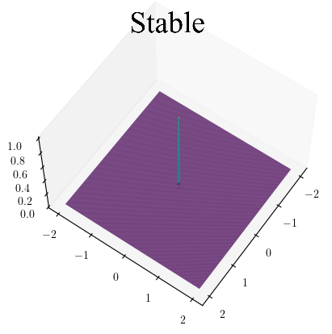


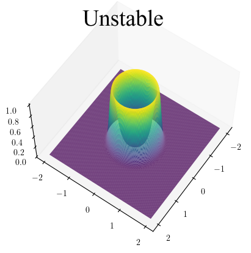
--

<br></br><br></br><br></br><br></br><br></br>

- Restricted analysis. Solution?


---
# Topology: Quantify the Shape of n-dim Tensors

???
Turns out that this problem of visualization can be solved with topology. Topology allows us to mathematically quantify the shape of such data without the need to plot them. 

Given a probability distribution represented by a n-dimensional tensor: topology-based algorithms return a vector against each likelihood value quantifying the shape of the tensor at that height. So for the single peak distribution on the left, it'd return a vector of 0s telling us that no loops or volcanos exist in the distribution. For the single volcano distribution in the center, it'd return a vector of 1s followed by 0s to represent the existence of one cycle. And for the more complicated distribution on the right with 2 dips in the distributino, the algorithm will return a vector of 2s followed by some 0s. 

--

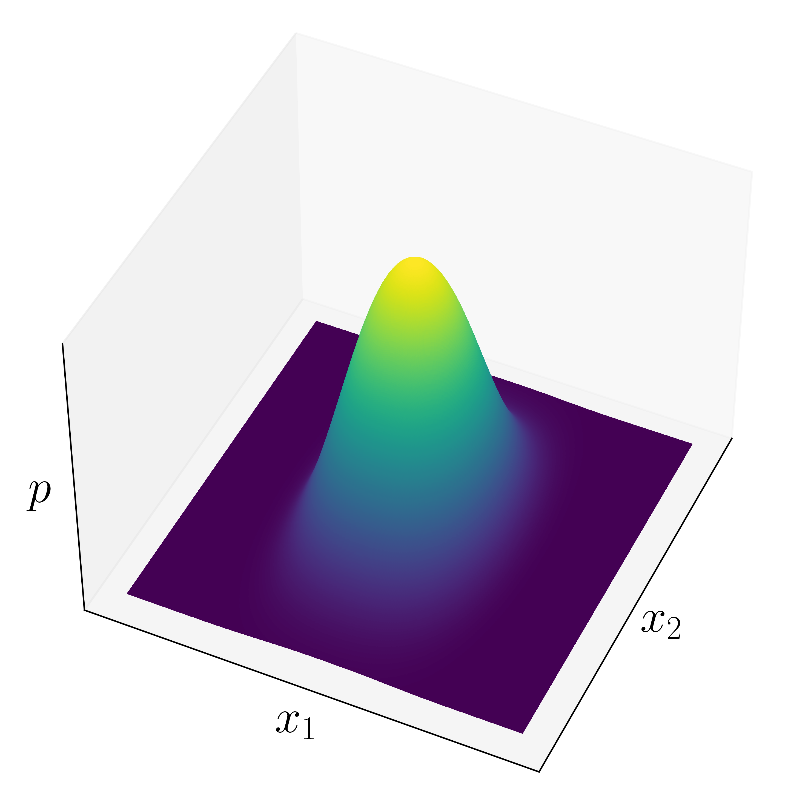

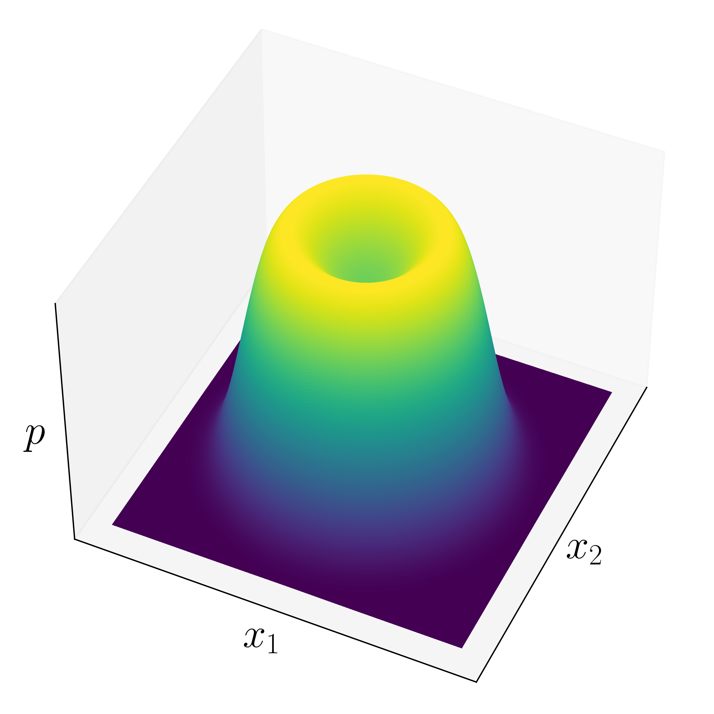

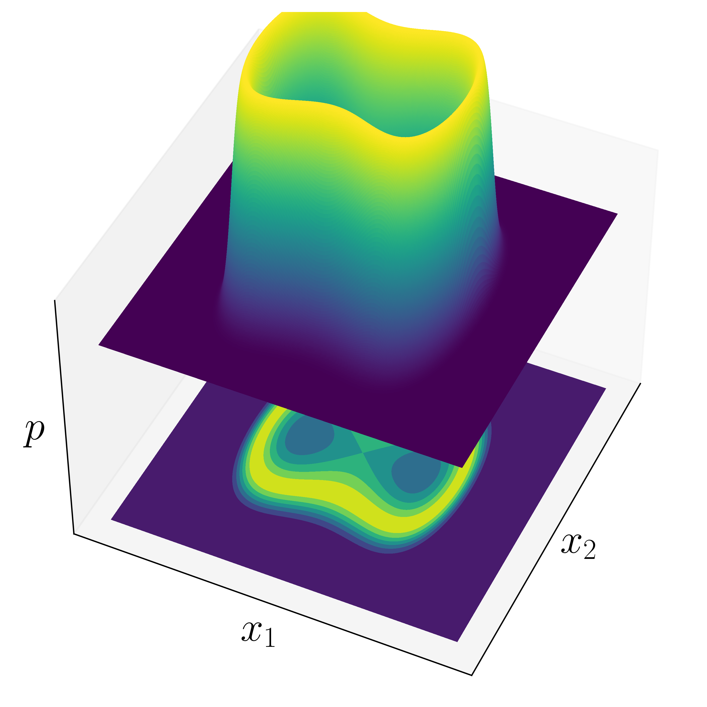

--
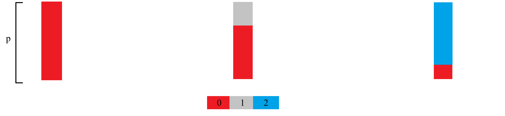

.footnote[Tanweer et al. (2024, February). A topological framework for identifying phenomenological bifurcations in stochastic dynamical systems. Nonlinear Dynamics. https://doi.org/10.1007/s11071-024-09289-1]


---
# Topology-Based Instability Detection

???
So for the simple wing model I showed earlier, we can compute the topology for various speeds and stack all the vectors together. This would give us a plot as shown on the right which indicates the speed at which oscillations and instability begins -- the grey region shows 1 cycle in the probability distribution -- the larger the grey in the vector, the higher the changes of large amplitude oscillations. 

--


--
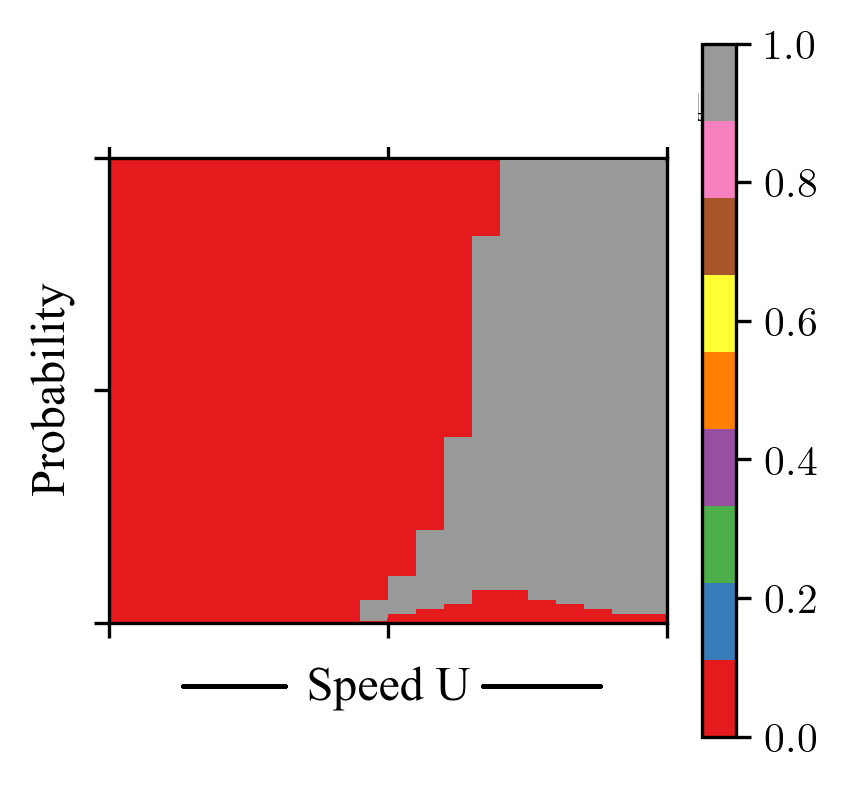

--


---
# Refined Investigation with Higher Fidelity Model

???
However, as I said earlier, this model is very simple and does not capture the complexities and the variety of factors which affect an airplane wing's behaviour. So, I ran a similar analysis for a higher fidelity model of airplane wings. 

The major difference in this higher fidelity model and the simpler model I showed, is that this model defines the lift and moment forces as nonlinear functions of time, and system states -- which makes it impossible to reduce the dimensionality and rely on only a 2-dimensional PDF.

Compared to the simpler model, this one is widely used for modelling this phenomenon -- but never fully analysed due to being unable to visualize the full PDF and the higher computational complexity of the pipeline. 

--

.panelset[

.panel[.panel-name[Preliminary Model]

<br></br><br></br><br></br><br></br>

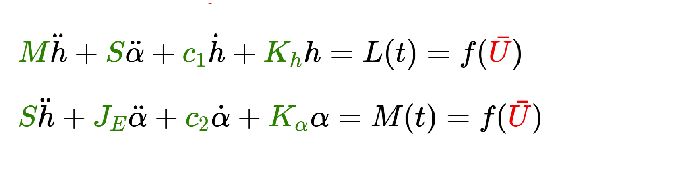

]


.panel[.panel-name[Higher Fidelity Model]

<br></br><br></br><br></br><br></br>

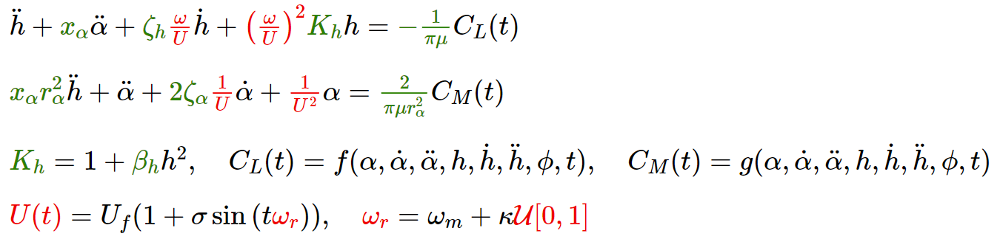

]
]

<br></br>

- Higher fidelity makes dimension reduction impossible.
- $p = p(\alpha, \dot{\alpha}, h, \dot{h})$

---
# Computational Complexity

???
Now, a little bit about the computational complexity of each step in the workflow. To solve stochastic equations, we need to run monte carlo simulations with complexity of NMdp where N is the number of sims, d is the dimension of the final density function, M is the discretization in time, and p is the size of the parameter space.

The probability distribution can be computed against each monte-carlo set with complexity of Npq^d, where q is the grid size.

And the topology can be computed with pq^d/2 times logq.

All of these seem huge, but the good thing is that each of these can be parallelized --- leading to lesser overall time required to run these simulations and gather the results. 

--

- Monte Carlo: $O(NMdp)$
- Probability Estimation: $O(Nq^dp)$
- Topology Computation: $O(pq^{d/2}\log{q})$


.footnote[N-simulations, d-dimension, M-time discretization, q-grid size, p-size of parameter space]

<br></br>

--

> Each step can be parallelized!

<br></br>

--
- Monte Carlo: $O(Md)$ -- $N \times p$ jobs
- Probability Estimation: $O(Nq^d)$ -- $p$ jobs
- Topology Computation: $O(q^{d/2}\log{q})$ -- $p$ jobs

---
# Noise Models

???

I tested three different turbulence models: a sinusoidal model, the Dryden model, and the Vonkarman model.  Dryden and Vonkarman models have temporal correlation between the turbulence's velocity at different times while the sinusoidal model is temporally uncorrelated.

--

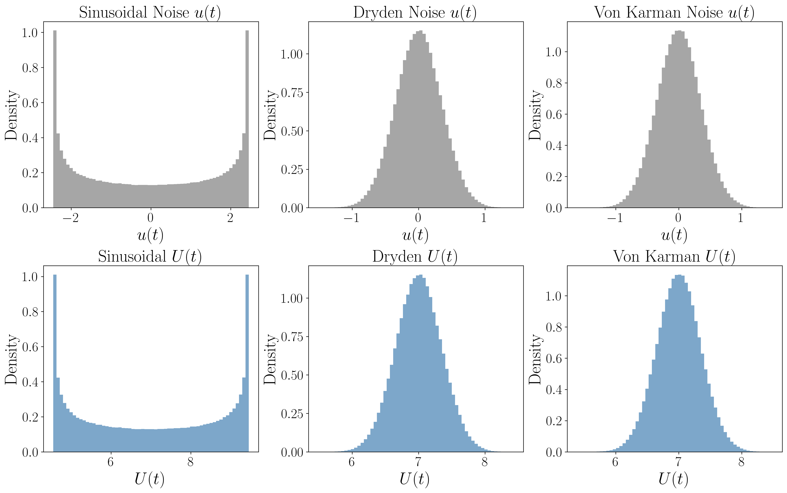
---
# Time History

???

The figures on this slide summarize representative time histories for three mean-flow speeds---a subcritical regime 
($U_m = 2.5$), a near-critical regime ($U_m = 4.5$), and a clearly supercritical regime ($U_m = 10.0$).

At low flow speeds ($U_m = 2.5$), all three models exhibit strongly damped transient responses. 
The pitch and plunge displacements, along with their velocities, decay to zero. Dryden and Von Karman 
excitations introduce small stochastic perturbations, but these remain well within the linear decay envelope too. As the flow speed approaches the instability threshold ($U_m = 4.5$), differences among the three models begin to emerge. The sinusoidal excitation still produces a decaying response, with no growth in amplitude. In contrast, both Dryden and Von Karman turbulence inject sufficient correlated energy to generate intermittent bursts of oscillation. These appear as modulated time-series 
envelopes ---although the system remains nominally stable due to the low amplitude of these. For supercritical flow speeds ($U_m = 10.0$), all three excitation models lead to sustained large-amplitude oscillations in pitch and plunge. 

Overall, the time-domain responses confirm that turbulence models with temporal correlation (i.e the Dryden and Von Karman) accelerate the onset of flutter-like oscillatory behavior.

--

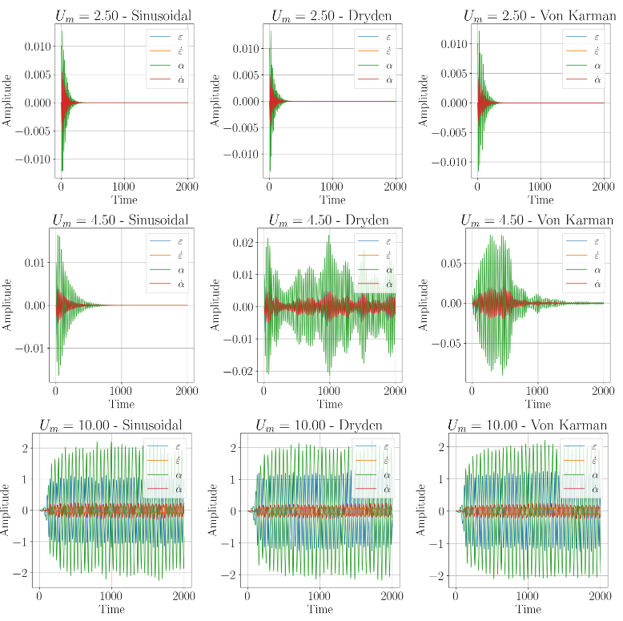
---
# Bifurcation Plot: H0 (Peaks)

???

Figures here show the homological bifurcation plots for the three turbulence models for 0-dimension homology.  
The horizontal axis corresponds to the mean flow speed \(U_m\), and the vertical axis corresponds 
to the superlevel parameter \(\varepsilon\) of the cubical complex filtration.
Each color indicates the Betti number \(\beta_k\) detected at that resolution, allowing us to 
identify when new components emerge in 
the stationary probability density.

For sinusoidal excitation, the density remains unimodal until approximately \(U_m \approx 5.5\) m/s, at which point the homological signature transitions from \(\beta_0 = 1\) to \(\beta_0 = 2\). This transition is sharp and confined to a relatively narrow band of \(\varepsilon\), consistent with the delayed instability onset seen in the time-domain dynamics. In contrast, both Dryden and Von Karman turbulence exhibit earlier and less abrupt transitions in \(H_0\).  
Under correlated turbulence, the density splits into multiple component as early as \(U_m \approx 5\) m/s, and this multi-component structure persists over a broader range of superlevel thresholds. This earlier appearance of \(\beta_0 = 2\) (and occasionally \(\beta_0 = 3,4\)) reflects the fact that temporally correlated noise can intermittently push the system toward flutter-like oscillations earlier

--


---
# Bifurcation Plot: H1 (Loops)

???

The transitions in the first homology group occurs around the same speed as \(H_0\) transitions. For sinusoidal excitation, persistent \(H_1\) homology emerge around \(U_m \approx 5.5\) m/s, matching the onset of clean, periodic behaviour in the time history. Dryden and Von Karman turbulence again produce earlier transitions with \(\beta_1 > 0\) appearing as early as \(U_m \approx 4.75\) m/s. In these models, the \(H_1\) “bifurcation tongue’’ slopes downward with increasing \(U_m\), 
indicating that while loops are born early, they persist mainly at intermediate probability levels.

--

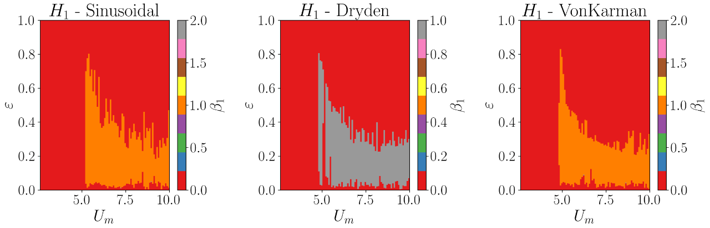

---
# Bifurcation Plot: H2 (Torus)

???

Although \(H_2\) features are weaker and more sporadic, all three models show some regions with \(\beta_2\) being non zero, primarily beyond \(U_m \approx 5\) m/s. These correspond to superlevel sets forming toroidal pockets in the estimated density, which occur when the stationary distribution develops a fully three-dimensional donut-like geometry in the space of pitch-plung with corresponding velocities. The \(H_2\) features appear sparsely for two reasons. First, the loops in this phase space are extremely thin, so the corresponding high-probability shell is narrow and susceptible to getting numerically smoothed out in the KDE. Second, the presence of noise smears the torus, flattening it and reducing the persistence of the central void. 

--

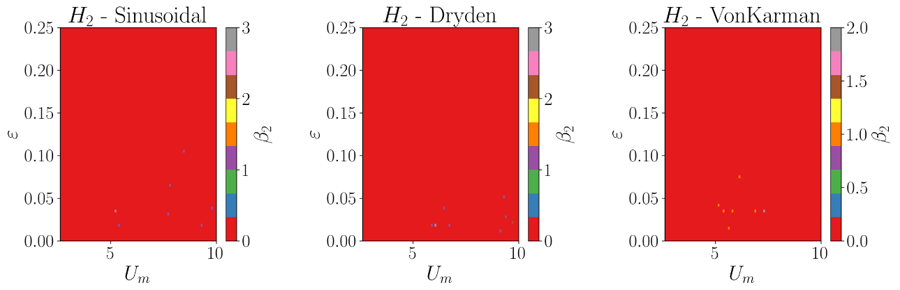

---
# Thank you! Question?

???
That wraps up my presentation. This work and talk were made possible with the contribution and help of these people, and funding from sources like AFOSR, MSU, NSF and Frontera fellowship. 

Thank you for listening!

--


Tanweer, S. & Khasawneh, F.A. (2025, December). P-Bifurcations in Stochastic Flutter Model Under Common Gust Perturbations. arXiv:2512.14678. Under review.